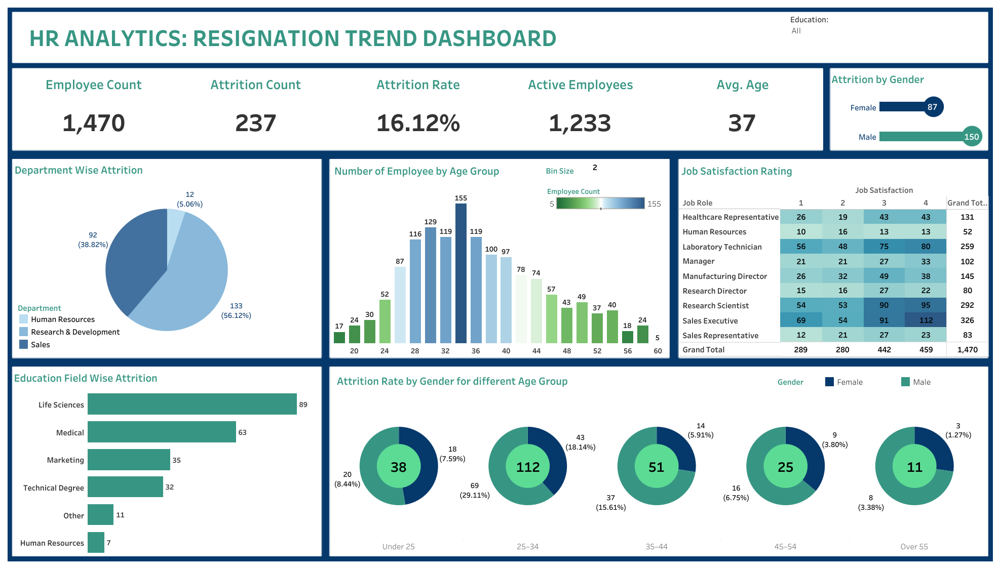

# HR Analytics: Resignation Trend Dashboard

This Tableau dashboard analyzes employee resignation trends using HR data. It helps identify key metrics like attrition rate, department-wise resignations, age group distributions, job satisfaction, and more.

---

## 📊 Key Insights:
- Overall attrition rate: **16.12%**
- Highest resignation rate from **Human Resources (25%)**
- Majority of resignations from employees aged **30–36**
- **Males** resign more often than females in each age group

---

## 📁 Files Included
- `HR_Resignation_Dashboard.twbx` – Tableau Packaged Workbook
- Folder `/data/` containing:
  - `employee_data.csv`

---

## 🛠 Tools Used
- [Tableau Public](https://public.tableau.com/)
- Microsoft Excel / CSV files

---

## 📌 Author
**Carmenita Lamba**
[LinkedIn](https://www.linkedin.com/in/carmenita-lamba-6a7555220/)

